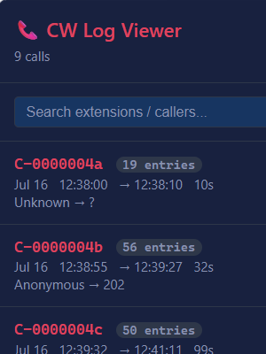
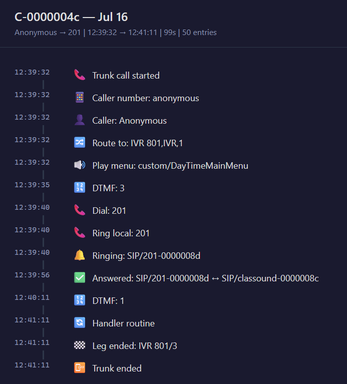

# CW (Callweaver) Log Viewer

A log analysis tool for **Callweaver / Wildix WMS** log files. Ingest a raw
`cw.log` (or similar) and get structured, filterable call-flow views — CLI for
quick triage or a built-in web UI for interactive browsing.



## What Problem This Solves

Callweaver / WMS produces dense, interleaved log streams where a single call
spans dozens of lines across multiple processes (`pbx_lua.c`, `pbx.c`,
`chan_sip.c`, `app_dial.c`, `app_queue.c`, …). Hunting for a specific call,
extension, or time window by grepping is tedious. This tool:

- Parses every log line into structured fields (timestamp, call-ID, process,
  log level, event ID, message, and parsed `pbx_lua.c` sub-fields).
- Groups entries by **Call-ID** so you see a call end-to-end.
- Offers multiple output modes: raw filtered lines, CSV export, call-flow
  summaries, and an interactive web UI.
- Lets you filter by call-ID, extension, process, and time range — all from
  one command.

## Prerequisites

- **Python 3.10 or later** — the project uses only the standard library;
  zero external dependencies.

## Installation

```bash
git clone https://github.com/timothiasthegreat/cw-log-viewer.git
cd cw-log-viewer
```

No virtual environment, no `pip install` — there are no dependencies. Just
Python.

## Quick Start

A sanitized demo log is included (`cwtrunc-demo.txt`) so you can try the tool
without real call data. Replace it with your own `cw.log` when you're ready.

```bash
# Raw log output (noise filtered out by default)
python cw_viewer.py cwtrunc-demo.txt

# List every call in the file: Call-ID, start/end time, entry count, first message
python cw_viewer.py cwtrunc-demo.txt --list-calls

# Call-flow summary for every call
python cw_viewer.py cwtrunc-demo.txt --summary

# Drill into one call
python cw_viewer.py cwtrunc-demo.txt --summary --call-id C-0000004c

# Interactive web UI (opens in your browser)
python cw_viewer.py cwtrunc-demo.txt --serve
```

## CLI Reference

```
python cw_viewer.py <logfile> [options]
```

### Output Modes (mutually exclusive)

| Flag | What You Get |
|---|---|
| *(none — default)* | Filtered raw log lines to stdout |
| `--summary`, `-s` | Structured call-flow summary: caller, destination, duration, and a chronological event list for each call |
| `--list-calls`, `-l` | Table of every Call-ID with start/end time, entry count, and first message |
| `--csv` | CSV export of filtered entries to stdout |
| `--serve`, `-w` | Start a web server with a browseable SPA (default: `http://127.0.0.1:8080`) |

### Filters

| Flag | Description |
|---|---|
| `--call-id`, `-c ID` | Exact Call-ID match (e.g. `C-0000004c`) |
| `--extension`, `--ext`, `-e NUM` | Lines whose message mentions this extension |
| `--process`, `-p NAME` | Filter by source file (e.g. `pbx_lua.c`, `app_dial.c`) |
| `--from`, `-f TIME` | Start time `HH:MM` or `HH:MM:SS` (inclusive) |
| `--to`, `-t TIME` | End time `HH:MM` or `HH:MM:SS` (inclusive) |

### Other Options

| Flag | Description |
|---|---|
| `--no-truncate`, `-T` | Print full log messages without truncating. By default, messages are sliced at 80 chars for `format_raw` and 60 chars for `--list-calls` to keep the table aligned; this flag disables that so the terminal wraps or scrolls instead |
| `--show-noise` | Include `config.c` and `res_awstranscribe.c` lines (excluded by default) |
| `--year YYYY` | Calendar year for timestamp parsing (default: current year) |
| `--host ADDR` | Web server listen address (default: `127.0.0.1`) |
| `--port PORT` | Web server listen port (default: `8080`) |

## Why `--year`?

Callweaver / WMS log timestamps look like this:

```
[Jul 16 13:05:06] VERBOSE[...] ...
```

They include **month, day, and time** but **no year**. Python's `datetime`
requires a year to parse a complete timestamp, so the parser defaults to the
**current calendar year**. That works fine for time-of-day filtering (`--from` / `--to`) — the
year doesn't affect comparisons when all entries share the same year.

Use `--year` when your log spans a year boundary (e.g. December→January) or
when you're inspecting historical logs from a different year. Without the
correct year, sort order and date-based logic will be off by anywhere from a
few hours to 365 days.

## Web UI

The `--serve` flag starts a local HTTP server with a single-page application.
It exposes a REST API (`/api/calls`, `/api/calls/<call-id>`, `/api/search`)
and a reactive front-end where you can search, filter, and click into any
call's detail view.

```bash
python cw_viewer.py cwtrunc.txt --serve

# Custom host/port
python cw_viewer.py cwtrunc.txt --serve --host 0.0.0.0 --port 9090
```



Click any event in the timeline to expand its raw log line (prefixed with `L<number>` — the line number in the source log file).

### API Endpoints

| Endpoint | Description |
|---|---|
| `GET /api/calls` | List all Call-IDs with metadata (start, end, entry count, first message) |
| `GET /api/calls/<call-id>` | Full entry list for a single Call-ID |
| `GET /api/search?q=...` | Search across all entries (call-ID, extension, message text) |
| `GET /api/stats` | Summary statistics: total calls, total entries, time span |

## Log Format

The tool expects logs in the standard Callweaver / Wildix WMS format:

```
[Mon dd HH:MM:SS] LEVEL[event_id][call_id] process: message
```

Example:

```
[Jul 16 13:05:06] VERBOSE[778400][C-0000004a] pbx_lua.c: -- Executing [104@internalcalls:1] Dial("SIP/104-0000002b", "SIP/104,20,...")
```

For `pbx_lua.c` lines, the `-- Executing [...]` sub-format is further parsed
into structured fields: dialed number, context, priority, action, channel, and
parameters — which powers the call-flow summary view.

## Project Structure

```
cw-log-viewer/
├── cw_viewer.py          # CLI entry point (parse args, dispatch)
├── src/cw_viewer/
│   ├── __init__.py
│   ├── models.py         # LogEntry dataclass
│   ├── parser.py         # Log file parser (regex-based)
│   ├── callflow.py       # Call grouping, filtering, and summaries
│   ├── output_formatter.py  # Raw, CSV, list-calls, and summary rendering
│   └── web_ui.py         # HTTP server + SPA (stdlib only)
└── tests/
    ├── test_parser.py
    ├── test_callflow.py
    ├── test_output_formatter.py
    └── test_web_ui.py
```

## Running Tests

```bash
python -m pytest tests/ -v
```

All tests are standard-library-only — no test dependencies beyond `pytest`.

## License

[MIT](LICENSE)